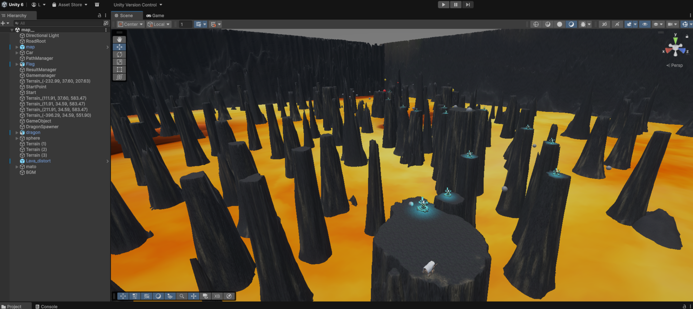

# 🎮 Game Development Portfolio

Unity / C# / VR Game Development

このリポジトリは、Unityを用いたゲーム開発プロジェクトを紹介するポートフォリオです。  
大学でのチーム開発を通して、**Unity** と **C#** を用いたゲーム制作に取り組みました。

ゲームプログラマーとして、ゲームの仕組みや物理挙動の実装に興味を持ち、  
**プレイヤーが楽しめるゲーム体験を作ること**を目標に開発を行っています。

---

# 🎮 プロジェクト一覧

| プロジェクト | 概要 | 状態 |
|---|---|---|
| **アロード (Arrowd)** | 弓矢で道路を作り、馬車をゴールまで導くVRアクションゲーム | 完成 |
| **Game Project 2** | 新しいゲームプロジェクト | 開発中 |
| **Game Project 3** | ゲーム企画段階のプロジェクト | 企画中 |

👉 **プロジェクト詳細**

- [アロード (Arrowd)](./arrowd)

---

# 🎮 プロジェクト紹介

## VRアクションゲーム「ア関ロード (Arrowd)」

弓矢を使って道路を生成し、  
馬車をゴールまで導くVRアクションゲームです。

大学のチーム開発プロジェクトとして制作しました。

📸 ゲーム画面  

👉 詳細ページ  
./arrowd

---

# 🧪 追加プロジェクト

## ⏱ カウントダウンタイマー（M5GO）

組み込みデバイス **M5GO** を使用して制作したタイマー装置です。

機能：

- 時・分・秒の設定
- カウントダウン機能
- アラーム通知
- スヌーズ機能
- RGBライト通知

使用技術：

- Embedded Programming
- Logic Control
- Hardware Interaction

---

# 👤 自己紹介

| 項目 | 内容 |
|---|---|
| 名前 | LIN |
| 専攻 | 情報系学科 |
| 興味分野 | ゲームプログラミング / Unity開発 |
| 使用言語 | C#, Python |

---

# 🛠 技術スキル

### プログラミング言語

- C#
- Python

### ゲーム開発

- Unity
- Physics Simulation
- Game Object Control
- Gameplay Programming

### 開発ツール

- Git
- GitHub

---

# 🚀 今後の目標

ゲームプログラマーとして技術力を高め、  
**プレイヤーに長く楽しんでもらえるゲーム開発**に携わりたいと考えています。
