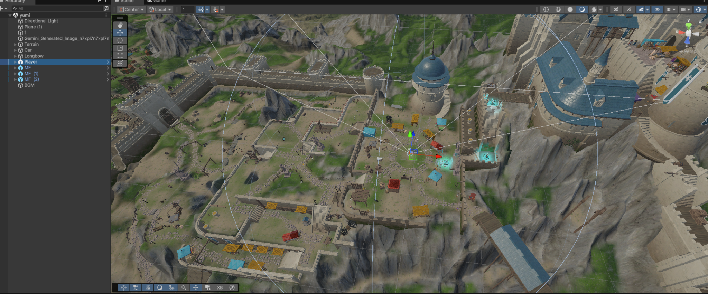

## 🎮 アロード (Arrowd)

弓矢を使って道路を生成し、馬車をゴールまで導くVRアクションゲームです。  
大学のチーム開発プロジェクトとして制作しました。

プレイヤーは弓矢を発射することで空中に道路を生成し、  
その道路を利用して馬車をゴールまで誘導します。  
VRならではの直感的な操作と物理挙動を活かしたゲーム体験を目指しました。

---

## 📸 ゲーム画面

### ステージ全体マップ

### ゲームプレイ画面

> ※ゲームプレイ中のスクリーンショット

---

## 👨‍💻 担当内容

このプロジェクトでは主に以下の部分を担当しました。

### ゲームオブジェクト制作
- 道路オブジェクトの制作
- 馬車モデルの制御実装（アニメーション制御）
- 転送クリスタルのアニメーション制御

### プログラム実装
- プレイヤー移動処理の実装
- オブジェクトの物理挙動制御
- ゲームオブジェクトの動作調整

### ゲームシステム調整
- オブジェクト挙動のデバッグ

---

## 💻 使用技術

- Unity
- C#
- VR Interaction
- Blender（3Dモデリング）

---

## 🧠 開発中の工夫・課題

担当したオブジェクト制御の実装において、ゲームオブジェクトの挙動が意図した通りに動作しない問題が発生しました。

原因を特定するために、スクリプトの処理内容やオブジェクトの設定を一つずつ確認しながら調整を行い、動作テストを繰り返しました。その結果、挙動を安定させることができ、ゲーム内で意図した動きを実現しました。

この経験を通して、Unityにおけるオブジェクト制御やデバッグの重要性を学びました。

---

## 🔗 チーム開発リポジトリ

チームで開発したプロジェクトのリポジトリはこちらです。

👉  
[https://github.com/pakipkaiyokoyama/arrowd-team2](https://github.com/pakipkaiyokoyama/arrowd-team2/tree/main/arrowd_vr/Assets/rin)

---

## 🎥 デモ動画

現在デモ動画を準備中です。  
ゲームプレイの流れが分かる動画を後日追加予定です。

※準備ができ次第、YouTubeリンクを掲載します。

---

## 📌 学んだこと

このプロジェクトを通して以下のスキルを身につけました。

- Unityを用いたゲーム開発の基礎
- ゲームオブジェクトの物理挙動制御
- チームでのゲーム開発プロセス
- VRゲームにおけるユーザー操作設計
